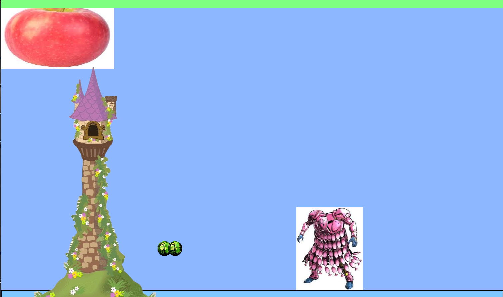

# Entry 4
##### 3/16/25

### Context

In this entry I follow my plan to create the beginning of my project working towards my MVP of my project. My plan was to finish the map and make my character function over the winter break. However I was sick and wasn't able to reach my goal, but here’s what I had so far.

### Project

[This](../kaboomfinal.html) is my project. I made a working tower with a health bar, and a working sprite player can control and shoot bullets.

## EDP(Engineering Design Process)

I'm at the part of a project where I'm starting to slowly use what I learn to make my ideal game, right now I'm working to have a functioning game. It may not be good, but I will work, like an actual game.

## Skills

I this entry I learn that when making your plan, you should plan your due day earlier than the final one, because if you got into problems like me, you would still have more time to work on it.

And I learn how to make a good and working plan, when planning you should write down actual doable stuff, and not just think you can finish everything in 2 day, spite the work into small part and work a little each day, so it wouldn't overwhelm you.

## Future Plan

Now I'm going to continual working on my project and hope I'm able to complete my MVP with no bug, by the next entry.

[Previous](entry03.md) | [Next](entry05.md)

[Home](../README.md)

