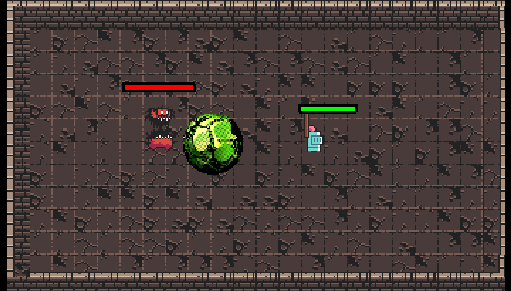
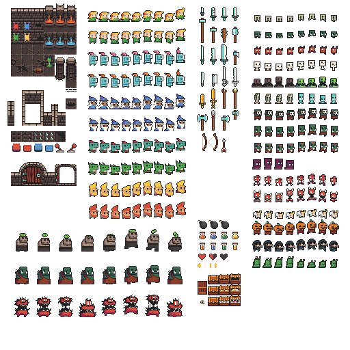

# Entry 5
##### 4/23/25


### Context


During the spring break I looked at my project again and I just felt like it isn't what I wanted so I restarted it and I used what I know before and used what I learned and created something new over the break.


### Project


[This](../kaboom3.0f.html) is my project. Instead of using img to make my map and players, I used sprite in replace of the image, so I can add some animation and create a 2D map.



## New Stuff


### loadSpriteAtlas


is a code to load all the sprite in one sprite sheet, for example this is the sprite sheet I use



and by using `loadSpriteAtlas` I was able to use all of this.


### How to use SpriteAtlas


well now you have all the sprites in one image you may ask how do you use them. Well it's kind of like what you do in P5js each you choose and X-axis and the Y axis and you choose how big you wanna load, good enough for me the creator of this Sprite Sheet lists all the position and size and I can input the value.


```js
loadSpriteAtlas("img/0x72_DungeonTilesetII_v1.7.png", {
    "hero": {
        "x": 128,
        "y": 68,
        "width": 144,
        "height": 28,
        "sliceX": 9,
        "anims": {
            "idle": {
                "from": 0,
                "to": 3,
                "speed": 3,
                "loop": true,
            },
            "run": {
                "from": 4,
                "to": 7,
                "speed": 10,
                "loop": true,
            },
            "hit": 8,
        },
    },
}
```


There is the code to load the hero in the sprite sheet, the `x` and `y` are the positions, and `width` and `height` are the sizes. The width is so big is because I'm loading `9` hero picture and I used `"sliceX"` to cut the width into 9 part, so it well only show one animation of the hero each time and not all three and you used command like `idle` as something will happen if the hero reach the `idle` state, `from` something `to` something is the amount of animation you wanna show, and a `loop` is import because it well repeat the sprite and make it look like a animation.
## EDP(Engineering Design Process)


right now I finished my MVP. My next goal is to create a sound effect and add more skill to the boss to make it harder, and if I have more time and ideas I will create more skill for the player too and create new levels and bosses.
## Skills


In this entry, something I learned is to take ideas from other people. Because I was able to know and use sprite, most people my classmate have a very similar creation like main so I took a look at what he did with his sprite and used it in my own project and it helped me understand and save a lot of time from learning.


## Future Plan


Now I'm going to make my game have more content, and make it better.


[Previous](entry03.md) | [Next](entry05.md)


[Home](../README.md)


